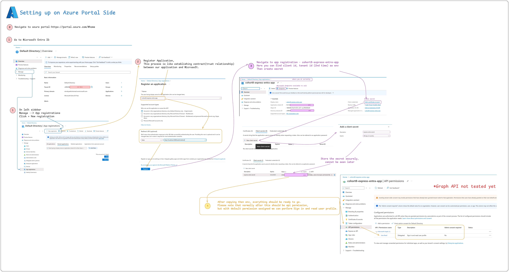
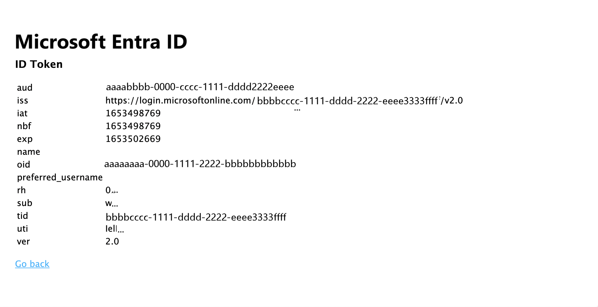
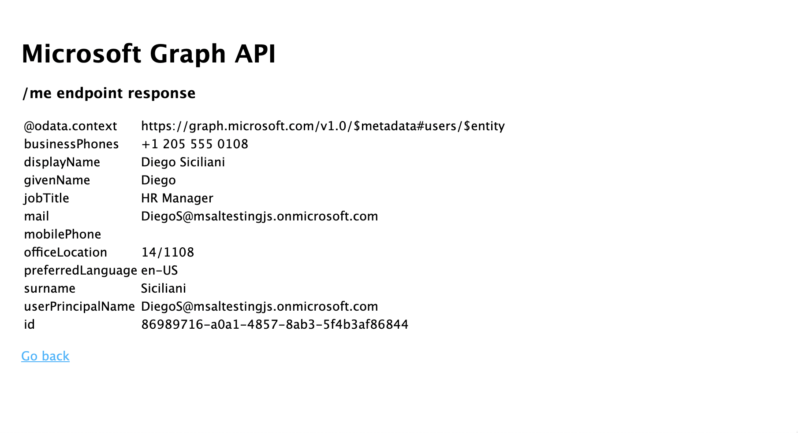

# Node Express Login Applciation to Microsoft Entra

## Clone the repo:
```bash
https://github.com/win-n-kyaw/express-entra-app.git
```

## Setup Environment

The app use node as runtime,make sure node is installed on your machine

```bash
npm install
```

### Edit the env variables accoridingly 

the default env file is .env.dev
 - CLOUD_INSTANCE |  related to Azure Active Directory (Azure AD) and represents an authentication endpoint rather than a cloud instance in the traditional sense.
 - TENANT_ID | unique identifier (GUID) assigned to an Azure AD tenant (organization).
 - CLIENT_ID | unique application identifier (GUID) assigned to a registered Azure Entra application.
 - CLIENT_SECRET | credential used by applications to authenticate themselves to Azure Entra when requesting tokens.
 - POST_LOGOUT_REDIRECT_URI | Redirect link after logging out (application side)
 - GRAPH_API_ENDPOINT | base URL for the Microsoft Graph API, which allows access to Microsoft 365 services
 - EXPRESS_SESSION_SECRET | A random string to establish express sessions

 Start the application

 The applicaiton runs default on localhost:3000 . 
 Custom ports can be done in /bin/www or with env

 ```bash
 npm start
 ``` 

 ## Setup Process on Azure Portal


## Token Sample Metadata


## Graph Api sample response


 ## Replication Reference
 - https://learn.microsoft.com/en-us/entra/identity-platform/tutorial-v2-nodejs-webapp-msal
